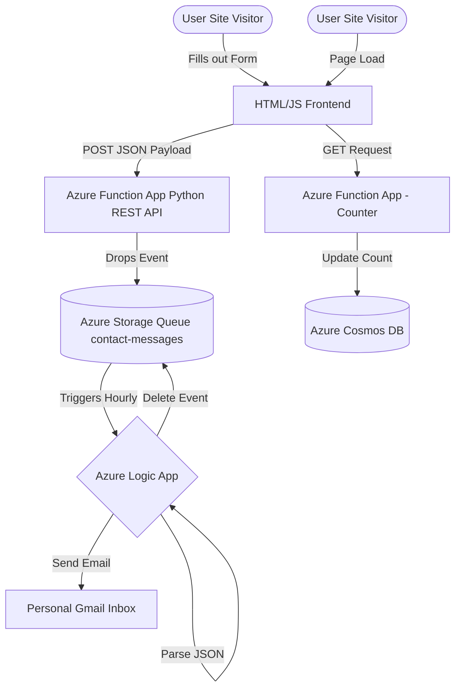

# Azure Cloud Resume Challenge & Serverless Portfolio

This repository contains the source code, infrastructure layout, and deployment pipelines for my personal portfolio website, built as part of the [Cloud Resume Challenge](https://cloudresumechallenge.dev/).

This project demonstrates a fully functional, event-driven, serverless architecture deployed on Microsoft Azure, completely automated via GitHub Actions and secured with DevSecOps best practices.

## Live Demo

**Website:** https://www.bmeinert.com
**Blog Post:** [Insert your blog post link here when finished]

## Architecture Overview

The application is broken down into a decoupled frontend and an event-driven Python REST API backend.

## Core Technologies Used

**Frontend:** HTML, CSS, Vanilla JavaScript

**Backend:** Python (v2 Programming Model)

**Compute:** Azure Functions (Serverless Linux Consumption Plan)

**Database & Storage:** Azure Cosmos DB (NoSQL), Azure Storage Queues

**Orchestration:** Azure Logic Apps

**Infrastructure as Code (IaC):** Terraform

**CI/CD & DevSecOps:** GitHub Actions, CodeQL

## Key Features

1. Serverless Visitor Counter
   A Python Azure Function triggered via HTTP GET request.

Communicates securely with Azure Cosmos DB via input/output bindings to retrieve, increment, and save the page view count.

JavaScript dynamically updates the frontend DOM to display the live count.

2. Event-Driven Contact Form
   Frontend JavaScript intercepts form submissions, formats data as a JSON payload, and securely POSTs to the API.

A Python Azure Function receives the payload and drops it into an Azure Storage Queue, decoupling web traffic from backend processing.

A CRON-scheduled Azure Logic App wakes up hourly, reads the queue, parses the JSON schema, dispatches a formatted email notification, and securely dequeues the message.

3. Automated CI/CD Pipelines
   Frontend Workflow: Triggers on pushes to the frontend/ directory, pushing static assets directly to Azure.

Backend Workflow: Triggers on pushes to the backend/ directory, resolving pip dependencies, building a deployment package, and securely publishing to the Azure Function App.

4. DevSecOps & Security
   CodeQL Scanning: A matrix-strategy GitHub Action runs automated security and vulnerability scanning against both Python and JavaScript codebases on every push to main and on a weekly schedule.

Secrets Management: No hardcoded credentials. All connections (Cosmos DB, Storage Queues) are handled via Azure Environment Variables and GitHub Secrets.

## Local Development

To run the backend locally using Azure Functions Core Tools:

Clone the repository.

Navigate to the backend directory.

Create a virtual environment: python -m venv .venv

Activate the environment and install dependencies: pip install -r requirements.txt

Create a local.settings.json file with your Azure connection strings.

Start the local server: func start
